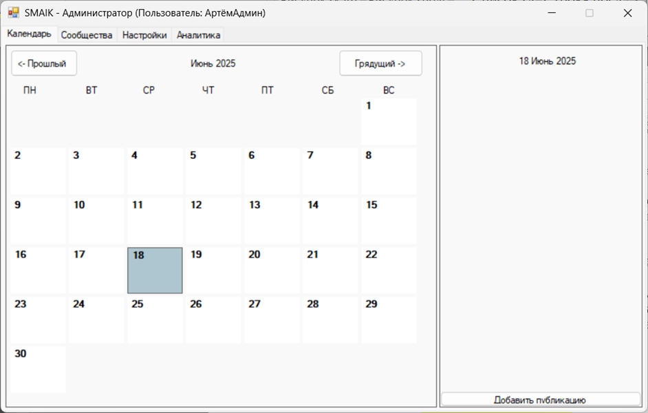
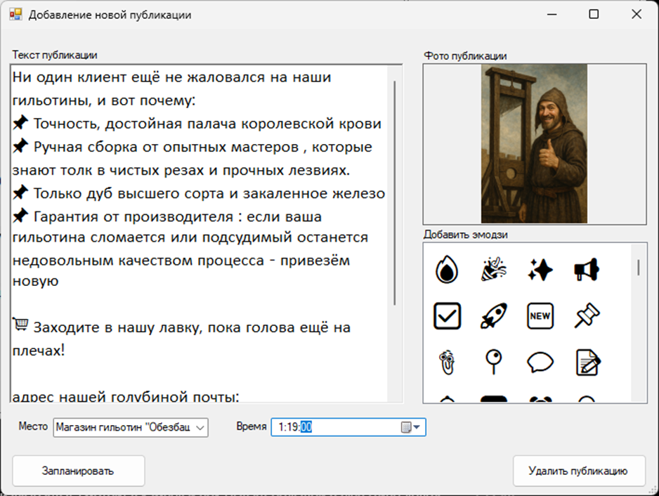

# 🍔 SMAIK (social media automatic instrumental kit)

An application for planning, editing and deleting publications in **VK** and **Telegram**, with support for plugins and analytics.

### Main functionality:
- 📅 Planning new publications (with attached images)
- ✏️ Editing of scheduled publications
- ❌ Deleting posts
- Work with:
  - VK (via user token)
  - Telegram (via bot token)

### Additional plugins:
- 🔤 **Correction of the keyboard layout** (for example, `Руддщ цщкдв` → `Hello world`)
- 🔗 **Formatted links** in the text
- 📋 **Formatting lists** (numbered and bulleted)
- 📊 **VK Community Analytics** (3 types of reports)

## 🛠️ Installation

1. Download the current version [from here](../../releases)
2. Install the program by following the instructions
3. Launch and log in using VK and Telegram tokens

## Screenshoots   
Main window:

Planning new publication:

